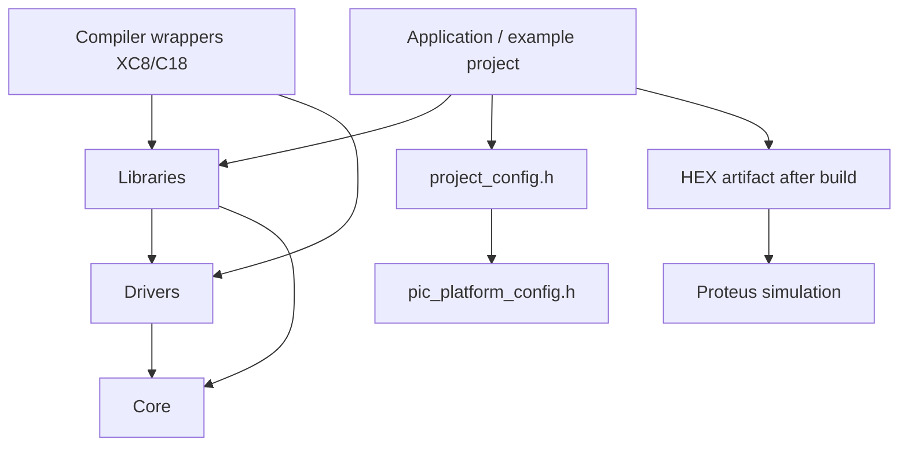

# Architecture

This repository is layered. Read this before adding new code.

## Real layers

- Application and examples live in `examples-projects/`.
- Reusable libraries live in `libraries/`.
- Low-level drivers live in `drivers/`.
- Shared helpers and compiler glue live in `core/`.
- Compiler wrappers live in `XC8/` and `C18/`.
- MCU-specific details stay in project code and device headers.
- Human docs live in `docs/` and example READMEs.
- HEX artifacts live in `examples-projects/hex/`.
- Proteus wiring docs live in `examples-projects/proteus/`.

## Dependency direction

- Examples may depend on libraries, drivers, and core.
- Libraries may depend on drivers and core.
- Drivers may depend on core and compiler wrappers.
- Reusable libraries must not depend on specific example projects.
- Project pin binding stays in `project_config.h` or application code.
- Compiler-specific code stays in `XC8/` or `C18/`.

## Platform view

## Practical examples

- `libraries/display/seven_segment` can be used in manual mode from the application loop or in timer-owned mode.
- `libraries/input/button` owns debounce and event logic.
- `libraries/input/segment_keys` reuses `seven_segment` and `button` for shared-line keys.
- `libraries/actuator/position_drive` uses callbacks for sensor read, motor drive, tick source, and optional debug output.
