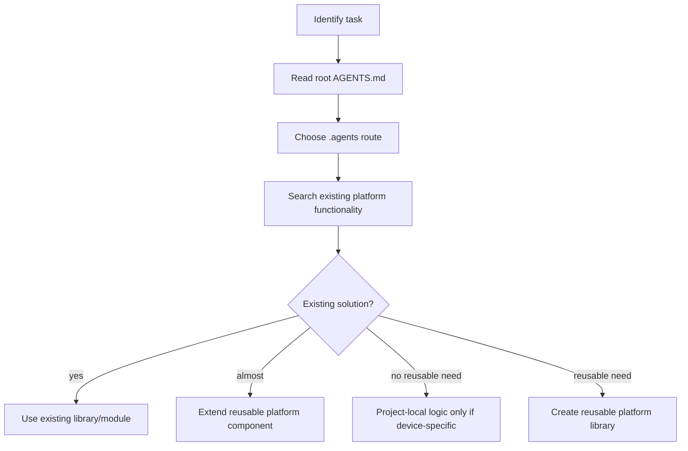

# AI Instructions Map

These files are for AI agents only. They are not a replacement for human README files and docs.

Use the map, do not read everything by default. Pick the branch that matches the task, then search for existing platform functionality before writing code.

Root entry point: [`AGENTS.md`](../AGENTS.md)

## How to use

1. Identify the task.
2. Read root `AGENTS.md`.
3. Follow the routing map to the smallest useful set of files.
4. Search the repo for an existing reusable solution.
5. Extend platform code if the logic belongs in `pic-platform`.
6. Keep project-local code only for device-specific or board-specific logic.

