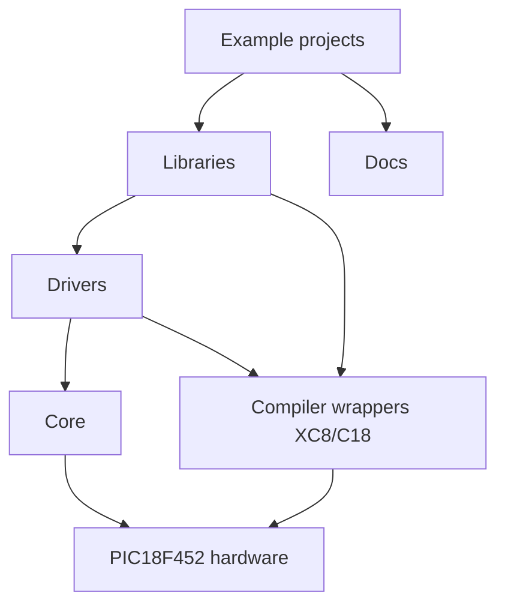
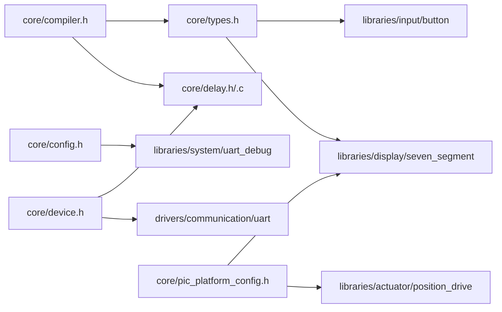
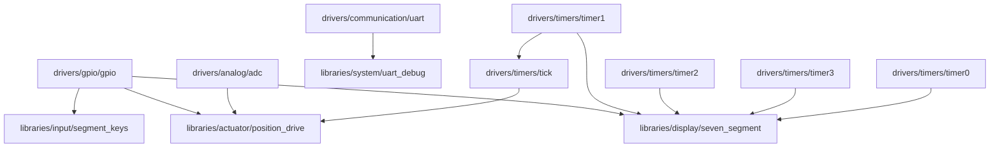
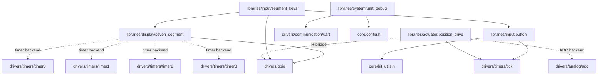
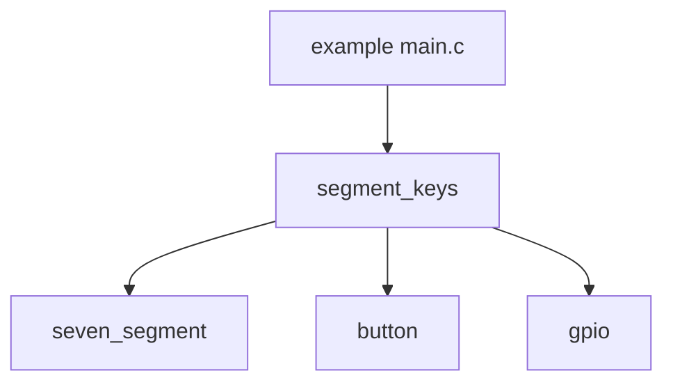
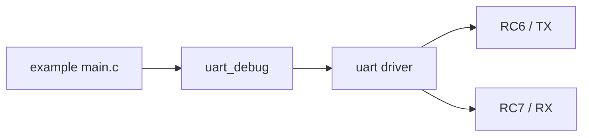
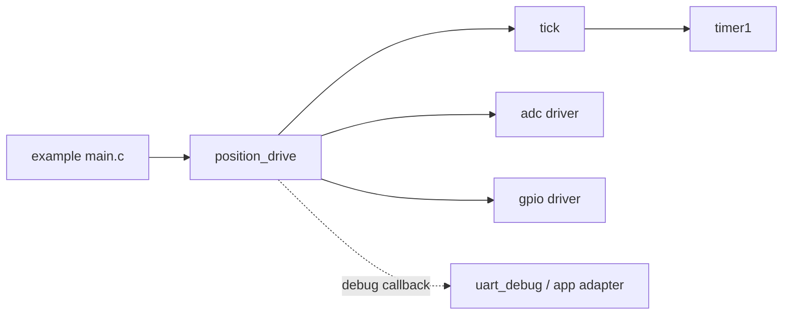

# Platform Dependency Graphs

## Platform Overview

## Core Dependencies

### Notes

- `core/compiler.h` selects XC8 or C18 and defines `DRV_INT_ENABLE()` / `DRV_INT_DISABLE()`.
- `core/device.h` resolves `_XTAL_FREQ` / `DRV_XTAL_FREQ` from `PIC_PLATFORM_CLOCK_HZ`.
- `core/pic_platform_config.h` provides default `SEVEN_SEGMENT_ENABLE_TIMERx` flags and
  `position_drive` feature flags.
- `core/delay.c` is used by the manual seven-segment examples.

## Driver Dependency Graph

### Resource ownership

- `Timer1 -> tick`
- `Timer2 -> seven_segment` when `SEVEN_SEGMENT_REFRESH_TIMER` selects `SEVEN_SEGMENT_TIMER2`
- `GPIO -> many libraries`
- `UART -> uart_debug` and UART-based debug examples
- `tick -> position_drive` (timeout / stuck detection)

## Library Dependency Graph

### Seven-segment

- Manual refresh mode: `seven_segment_process()` or `seven_segment_refresh()` is called from the application loop.
- Timer-backed mode: `seven_segment_init()` owns one timer slot and the application forwards interrupts to `seven_segment_irq_handler()`.
- `SEVEN_SEGMENT_ENABLE_TIMER0..3` must match the drivers actually added to the MPLAB project.
- `tick` already owns `Timer1`, so a display backend must not also request `Timer1` in the same project.

### segment_keys

#### Single-line keys

| Electrical meaning | Raw mask | Button event | Example project | Required files |
| --- | --- | --- | --- | --- |
| `A` pressed on RD0 | `0x01` | `U` / select | `examples-projects/xc8/seven_segment/keys_single_line.X` | `main.c`, `config_bits.c`, `project_config.h`, `core/delay.c`, `drivers/communication/uart/uart.c`, `drivers/gpio/gpio.c`, `drivers/timers/tick/tick.c`, `drivers/timers/timer1/timer1.c`, `libraries/display/seven_segment/seven_segment.c`, `libraries/input/button/button.c`, `libraries/input/segment_keys/segment_keys.c`, `libraries/system/uart_debug/uart_debug.c` |
| `B` pressed on RD1 | `0x02` | `D` / down | same | same |
| `C` pressed on RD2 | `0x04` | `O` / OK | same | same |

#### Diode-coded keys

| Electrical meaning | Raw mask | Button event | Example project | Required files |
| --- | --- | --- | --- | --- |
| `A` | `0x01` | `S` / select next digit | `examples-projects/xc8/seven_segment/keys_diode_coded.X` | `main.c`, `config_bits.c`, `project_config.h`, `core/delay.c`, `drivers/communication/uart/uart.c`, `drivers/gpio/gpio.c`, `drivers/timers/tick/tick.c`, `drivers/timers/timer1/timer1.c`, `libraries/display/seven_segment/seven_segment.c`, `libraries/input/button/button.c`, `libraries/input/segment_keys/segment_keys.c`, `libraries/system/uart_debug/uart_debug.c` |
| `A + B` | `0x03` | `+` / increment digit | same | same |
| `A + B + C` | `0x07` | `-` / decrement digit | same | same |

### UART debug

- For Proteus one-way debug: `PIC RC6/TX -> Virtual Terminal RXD`, `GND -> GND`.
- Use `9600 8N1` unless the example overrides it.

### position_drive

- `position_drive_init()` stores the config and the `read_raw` / `get_tick` / `motor` callbacks.
- The ADC backend reads the sensor through `read_raw`; other backends return `DRV_STATUS_UNSUPPORTED`.
- Optional PWM speed output is compiled only when `POSITION_DRIVE_ENABLE_PWM=1` and then requires a
  `set_speed` callback; by default the PWM path is compiled out.
- The encoder sensor backend is an unsupported placeholder: `init()` returns `DRV_STATUS_UNSUPPORTED`
  until a real encoder driver exists.
- `position_drive_process()` must be called regularly from the application loop; it runs bang-bang
  control with overshoot correction and optional timeout / stuck detection.
- `Timer1` is owned by `tick`, which feeds `get_tick` for timeout and stuck detection.
- Debug output is callback-based and routed by the application; `position_drive` does not depend on
  UART directly when debug is disabled.

## Example Usage

### Which files to add for common tasks

#### Seven-segment manual display

- `examples-projects/xc8/seven_segment/basic_manual.X/main.c`
- `examples-projects/xc8/seven_segment/basic_manual.X/config_bits.c`
- `examples-projects/xc8/seven_segment/basic_manual.X/project_config.h`
- `core/delay.c`
- `drivers/gpio/gpio.c`
- `libraries/display/seven_segment/seven_segment.c`

#### Seven-segment multiplex display

- `examples-projects/xc8/seven_segment/multiplex_manual.X/main.c`
- `examples-projects/xc8/seven_segment/multiplex_manual.X/config_bits.c`
- `examples-projects/xc8/seven_segment/multiplex_manual.X/project_config.h`
- `core/delay.c`
- `drivers/gpio/gpio.c`
- `libraries/display/seven_segment/seven_segment.c`

#### Seven-segment + timer-backed refresh

- `examples-projects/xc8/seven_segment/multiplex_timer.X/main.c`
- `examples-projects/xc8/seven_segment/multiplex_timer.X/config_bits.c`
- `examples-projects/xc8/seven_segment/multiplex_timer.X/project_config.h`
- `drivers/timers/timer2/timer2.c`
- `drivers/gpio/gpio.c`
- `libraries/display/seven_segment/seven_segment.c`

#### Seven-segment + segment keys

- `examples-projects/xc8/seven_segment/keys_single_line.X/main.c`
- `examples-projects/xc8/seven_segment/keys_diode_coded.X/main.c`
- `drivers/timers/tick/tick.c`
- `drivers/timers/timer1/timer1.c`
- `libraries/input/button/button.c`
- `libraries/input/segment_keys/segment_keys.c`
- `libraries/display/seven_segment/seven_segment.c`
- `drivers/gpio/gpio.c`

#### UART debug

- `drivers/communication/uart/uart.c`
- `libraries/system/uart_debug/uart_debug.c`

#### Position drive (ADC backend)

- `examples-projects/xc8/actuator/position_drive_adc.X/main.c`
- `examples-projects/xc8/actuator/position_drive_adc.X/config_bits.c`
- `examples-projects/xc8/actuator/position_drive_adc.X/project_config.h`
- `drivers/analog/adc/adc.c`
- `drivers/gpio/gpio.c`
- `drivers/timers/tick/tick.c`
- `drivers/timers/timer1/timer1.c`
- `libraries/actuator/position_drive/position_drive.c`

## Resource Conflicts

- `Timer1` cannot be owned by both `tick` and a `seven_segment` timer backend.
- Manual refresh avoids timer ownership entirely.
- UART pins `RC6/RC7` conflict with any other UART/RS485 use on the same pins.
- `PORTD` PSP mode must be disabled before using `PORTD` as segment GPIO.
- Analog-capable pins must be configured as digital via `ADCON1 = 0x07U` in the examples that use `PORTD` and `PORTC` as GPIO.
- A project may only use one position sensor backend at a time; the ADC backend owns the `adc` driver and the chosen analog channel.
