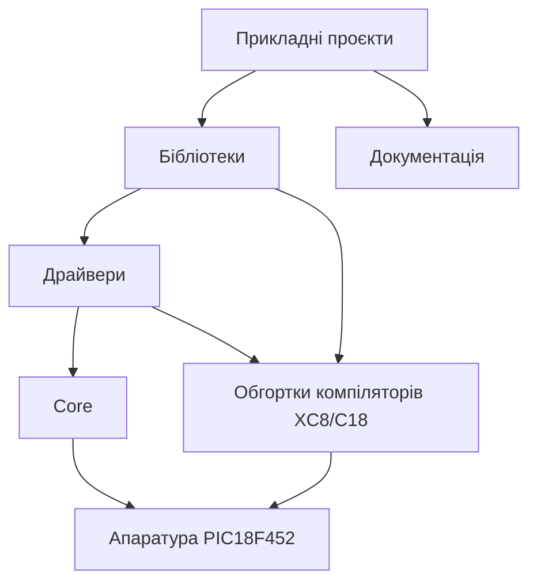
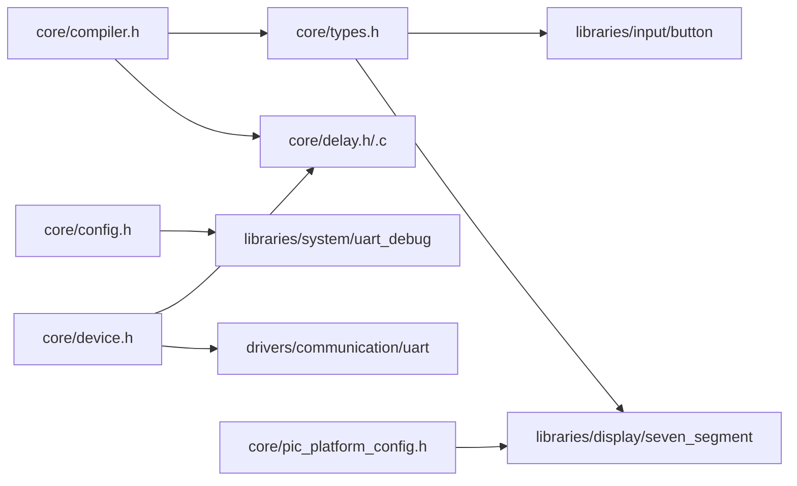
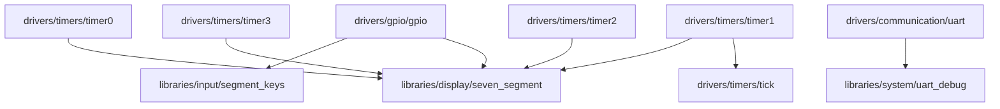
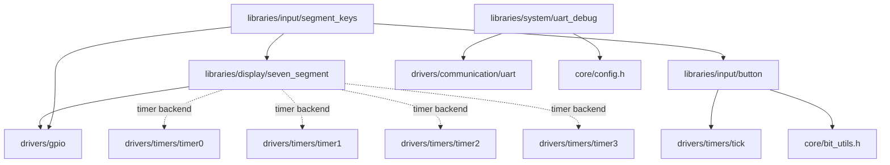
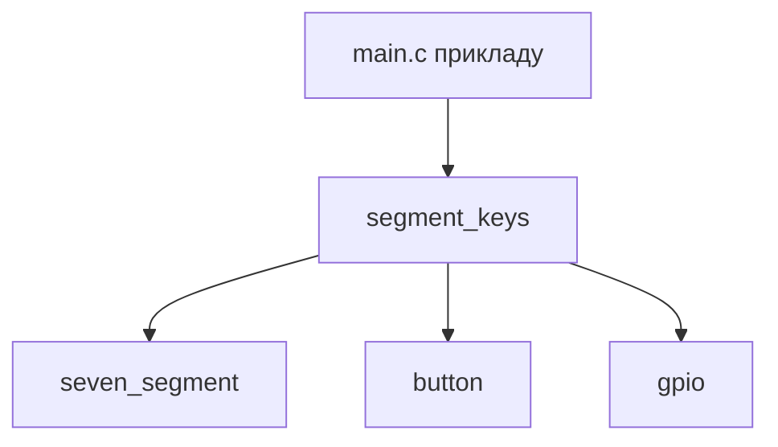
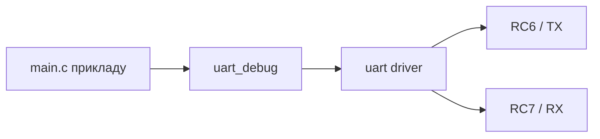

# Графи залежностей платформи

## Огляд платформи

## Залежності Core

### Примітки

- `core/compiler.h` вибирає XC8 або C18 і визначає `DRV_INT_ENABLE()` / `DRV_INT_DISABLE()`.
- `core/device.h` отримує `_XTAL_FREQ` / `DRV_XTAL_FREQ` з `PIC_PLATFORM_CLOCK_HZ`.
- `core/pic_platform_config.h` задає дефолтні `SEVEN_SEGMENT_ENABLE_TIMERx`.
- `core/delay.c` використовується прикладами з manual refresh.

## Залежності Driver

### Власність ресурсів

- `Timer1 -> tick`
- `Timer2 -> seven_segment` коли `SEVEN_SEGMENT_REFRESH_TIMER` вибирає `SEVEN_SEGMENT_TIMER2`
- `GPIO -> many libraries`
- `UART -> uart_debug` і UART-приклади

## Залежності Library

### seven_segment

- Manual refresh mode: `seven_segment_process()` або `seven_segment_refresh()` викликає application loop.
- Timer-backed mode: `seven_segment_init()` бере один timer slot, а application forward-ить interrupts у `seven_segment_irq_handler()`.
- `SEVEN_SEGMENT_ENABLE_TIMER0..3` мають відповідати драйверам, доданим у MPLAB project.
- `tick` уже володіє `Timer1`, тому display backend не повинен також просити `Timer1`.

### segment_keys

#### Single-line keys

| Електричний зміст | Raw mask | Button event | Example project | Required files |
| --- | --- | --- | --- | --- |
| `A` натиснуто на RD0 | `0x01` | `U` / select | `examples-projects/xc8/seven_segment/keys_single_line.X` | `main.c`, `config_bits.c`, `project_config.h`, `core/delay.c`, `drivers/communication/uart/uart.c`, `drivers/gpio/gpio.c`, `drivers/timers/tick/tick.c`, `drivers/timers/timer1/timer1.c`, `libraries/display/seven_segment/seven_segment.c`, `libraries/input/button/button.c`, `libraries/input/segment_keys/segment_keys.c`, `libraries/system/uart_debug/uart_debug.c` |
| `B` натиснуто на RD1 | `0x02` | `D` / down | same | same |
| `C` натиснуто на RD2 | `0x04` | `O` / OK | same | same |

#### Diode-coded keys

| Електричний зміст | Raw mask | Button event | Example project | Required files |
| --- | --- | --- | --- | --- |
| `A` | `0x01` | `S` / select next digit | `examples-projects/xc8/seven_segment/keys_diode_coded.X` | `main.c`, `config_bits.c`, `project_config.h`, `core/delay.c`, `drivers/communication/uart/uart.c`, `drivers/gpio/gpio.c`, `drivers/timers/tick/tick.c`, `drivers/timers/timer1/timer1.c`, `libraries/display/seven_segment/seven_segment.c`, `libraries/input/button/button.c`, `libraries/input/segment_keys/segment_keys.c`, `libraries/system/uart_debug/uart_debug.c` |
| `A + B` | `0x03` | `+` / increment digit | same | same |
| `A + B + C` | `0x07` | `-` / decrement digit | same | same |

### UART debug

- Для Proteus one-way debug: `PIC RC6/TX -> Virtual Terminal RXD`, `GND -> GND`.
- Використовуйте `9600 8N1`, якщо приклад не задає інше.

## Рецепти використання

### Які файли додати для common tasks

#### Seven-segment manual display

- `examples-projects/xc8/seven_segment/basic_manual.X/main.c`
- `examples-projects/xc8/seven_segment/basic_manual.X/config_bits.c`
- `examples-projects/xc8/seven_segment/basic_manual.X/project_config.h`
- `core/delay.c`
- `drivers/gpio/gpio.c`
- `libraries/display/seven_segment/seven_segment.c`

#### Seven-segment multiplex display

- `examples-projects/xc8/seven_segment/multiplex_manual.X/main.c`
- `examples-projects/xc8/seven_segment/multiplex_manual.X/config_bits.c`
- `examples-projects/xc8/seven_segment/multiplex_manual.X/project_config.h`
- `core/delay.c`
- `drivers/gpio/gpio.c`
- `libraries/display/seven_segment/seven_segment.c`

#### Seven-segment + timer-backed refresh

- `examples-projects/xc8/seven_segment/multiplex_timer.X/main.c`
- `examples-projects/xc8/seven_segment/multiplex_timer.X/config_bits.c`
- `examples-projects/xc8/seven_segment/multiplex_timer.X/project_config.h`
- `drivers/timers/timer2/timer2.c`
- `drivers/gpio/gpio.c`
- `libraries/display/seven_segment/seven_segment.c`

#### Seven-segment + segment keys

- `examples-projects/xc8/seven_segment/keys_single_line.X/main.c`
- `examples-projects/xc8/seven_segment/keys_diode_coded.X/main.c`
- `drivers/timers/tick/tick.c`
- `drivers/timers/timer1/timer1.c`
- `libraries/input/button/button.c`
- `libraries/input/segment_keys/segment_keys.c`
- `libraries/display/seven_segment/seven_segment.c`
- `drivers/gpio/gpio.c`

#### UART debug

- `drivers/communication/uart/uart.c`
- `libraries/system/uart_debug/uart_debug.c`

## Resource Conflicts

- `Timer1` cannot be owned by both `tick` and a `seven_segment` timer backend.
- Manual refresh avoids timer ownership entirely.
- UART pins `RC6/RC7` conflict with other UART/RS485 use on the same pins.
- `PORTD` PSP mode must be disabled before using `PORTD` as segment GPIO.
- Analog-capable pins must be configured as digital via `ADCON1 = 0x07U` in the examples that use `PORTD` and `PORTC` as GPIO.
