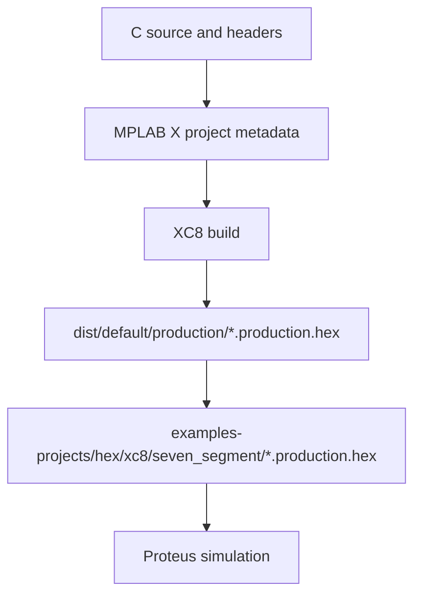

# Code and Artifact Generation Workflow

## What Is Generated or Updated by MPLAB X

- `examples-projects/xc8/<example>.X/nbproject/configurations.xml`
- `examples-projects/xc8/<example>.X/nbproject/project.xml`
- `examples-projects/xc8/<example>.X/nbproject/Makefile-default.mk`
- `examples-projects/xc8/<example>.X/dist/default/production/*.production.hex`
- `examples-projects/hex/xc8/seven_segment/<example>.X.production.hex`

## What Not to Commit

- `build/`
- `dist/`
- `debug/`
- `nbproject/private/`
- `*.elf`
- `*.p1`
- `*.o`
- `*.obj`
- `*.map`

## When HEX Must Be Regenerated

Regenerate production HEX after changes to:

- example `main.c`
- `project_config.h`
- `config_bits.c`
- library source files
- driver source files
- compiler wrapper source files

## How to Regenerate HEX

Use the MPLAB X generated Makefile from the example folder.

```cmd
cd /d examples-projects\xc8\seven_segment\keys_diode_coded.X
make -f nbproject\Makefile-default.mk SUBPROJECTS= .clean-conf
make -f nbproject\Makefile-default.mk SUBPROJECTS= .build-conf
```

If `make` is not on `PATH`, call the MPLAB X toolchain copy directly:

```cmd
"C:\Program Files\Microchip\MPLABX\v6.30\gnuBins\GnuWin32\bin\make.exe" -f nbproject\Makefile-default.mk SUBPROJECTS= .clean-conf
"C:\Program Files\Microchip\MPLABX\v6.30\gnuBins\GnuWin32\bin\make.exe" -f nbproject\Makefile-default.mk SUBPROJECTS= .build-conf
```

## Copying HEX Into Repository Artifacts

Mapping:

```text
examples-projects/xc8/seven_segment/<project>.X/dist/default/production/<project>.X.production.hex
->
examples-projects/hex/xc8/seven_segment/<project>.X.production.hex
```

Example:

```text
examples-projects/xc8/seven_segment/keys_diode_coded.X/dist/default/production/keys_diode_coded.X.production.hex
->
examples-projects/hex/xc8/seven_segment/keys_diode_coded.X.production.hex
```

## How to Check That HEX Is Current

Run:

```bash
git status --short
git diff --stat
```

If rebuild changes a tracked `.hex`, verify it and commit it separately.

## Commit Rules for Generated Artifacts

- Keep functional C changes in their own commit.
- Keep documentation changes in their own commit.
- Keep HEX artifacts in their own commit.
- Do not mix HEX, C code, and docs unless there is no practical alternative.

## Build Flow


