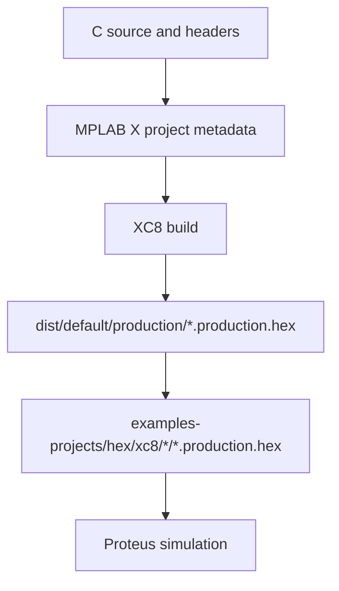

# Workflow генерації коду та артефактів

## Що генерується або оновлюється MPLAB X

- `examples-projects/xc8/<example>.X/nbproject/configurations.xml`
- `examples-projects/xc8/<example>.X/nbproject/project.xml`
- `examples-projects/xc8/<example>.X/nbproject/Makefile-default.mk`
- `examples-projects/xc8/<example>.X/dist/default/production/*.production.hex`
- `examples-projects/hex/xc8/seven_segment/<example>.X.production.hex`
- `examples-projects/hex/xc8/actuator/<example>.X.production.hex`

## Що не потрібно комітити

- `build/`
- `dist/`
- `debug/`
- `nbproject/private/`
- `*.elf`
- `*.p1`
- `*.o`
- `*.obj`
- `*.map`

## Коли треба перегенерувати HEX

Оновлюйте production HEX після змін у:

- `main.c` прикладу
- `project_config.h`
- `config_bits.c`
- source-файлах бібліотек
- source-файлах драйверів
- compiler wrapper source files

## Як перегенерувати HEX

Використовуйте MPLAB X generated Makefile з folder прикладу.

```cmd
cd /d examples-projects\xc8\seven_segment\keys_diode_coded.X
make -f nbproject\Makefile-default.mk SUBPROJECTS= .clean-conf
make -f nbproject\Makefile-default.mk SUBPROJECTS= .build-conf
```

Для position drive прикладу:

```cmd
cd /d examples-projects\xc8\actuator\position_drive_adc.X
make -f nbproject\Makefile-default.mk SUBPROJECTS= .clean-conf
make -f nbproject\Makefile-default.mk SUBPROJECTS= .build-conf
```

Якщо `make` не в `PATH`, викличте його напряму:

```cmd
"C:\Program Files\Microchip\MPLABX\v6.30\gnuBins\GnuWin32\bin\make.exe" -f nbproject\Makefile-default.mk SUBPROJECTS= .clean-conf
"C:\Program Files\Microchip\MPLABX\v6.30\gnuBins\GnuWin32\bin\make.exe" -f nbproject\Makefile-default.mk SUBPROJECTS= .build-conf
```

## Як копіювати HEX у repository artifacts

Мапінг:

```text
examples-projects/xc8/seven_segment/<project>.X/dist/default/production/<project>.X.production.hex
->
examples-projects/hex/xc8/seven_segment/<project>.X.production.hex
```

Приклад:

```text
examples-projects/xc8/seven_segment/keys_diode_coded.X/dist/default/production/keys_diode_coded.X.production.hex
->
examples-projects/hex/xc8/seven_segment/keys_diode_coded.X.production.hex
```

Position drive приклад мапується так само, але у `actuator`:

```text
examples-projects/xc8/actuator/position_drive_adc.X/dist/default/production/position_drive_adc.X.production.hex
->
examples-projects/hex/xc8/actuator/position_drive_adc.X.production.hex
```

## Як перевірити, що HEX актуальний

Запустіть:

```bash
git status --short
git diff --stat
```

Якщо rebuild змінив tracked `.hex`, перевірте його та комітьте окремо.

## Правило commits для generated artifacts

- functional C changes окремо.
- documentation окремо.
- HEX artifacts окремо.
- Не змішуйте HEX, C code і docs без причини.

## Build flow


