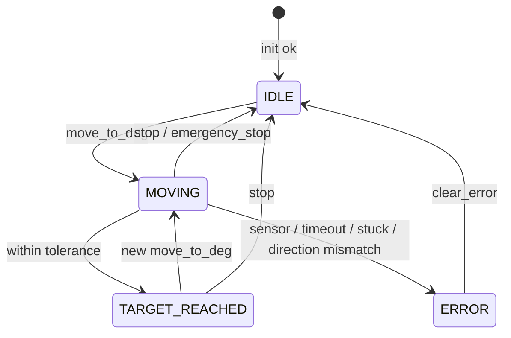
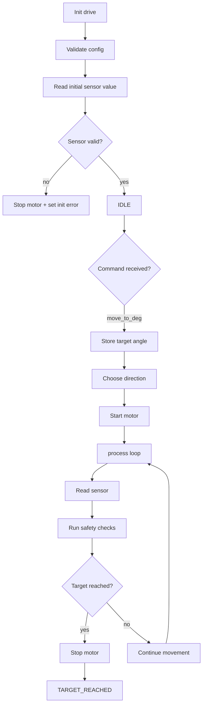
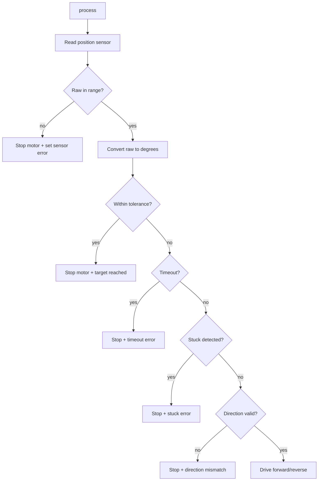
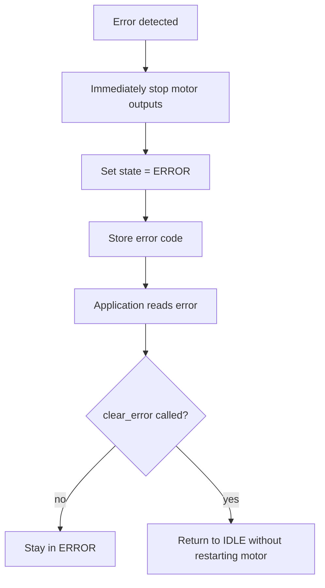
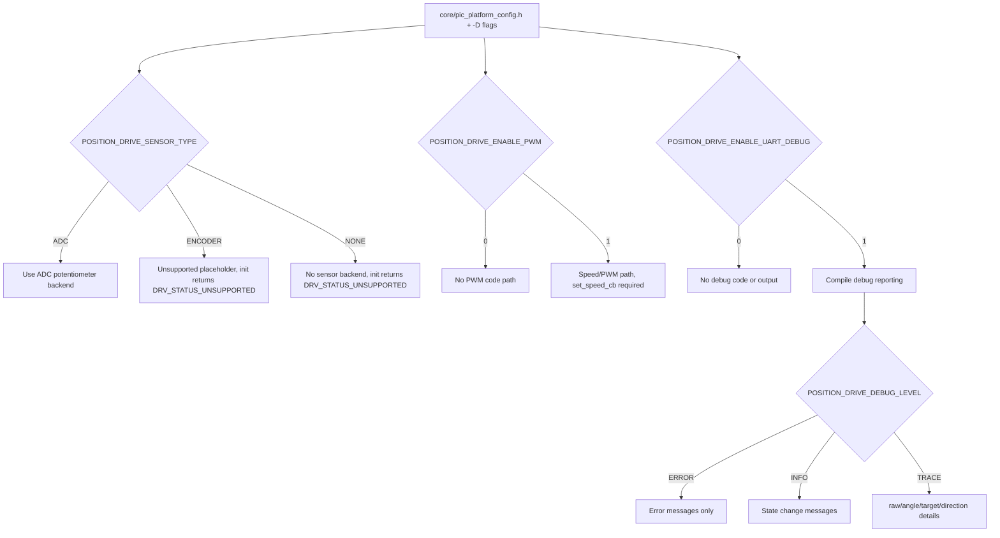
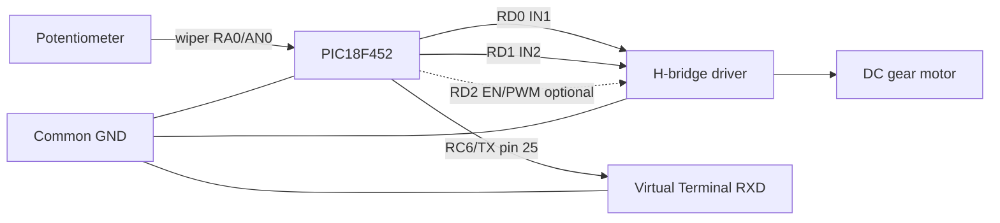
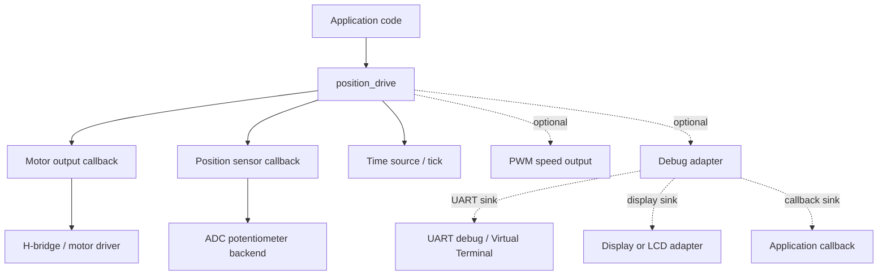
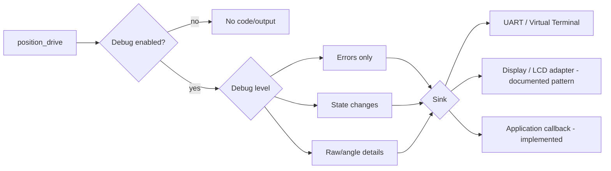
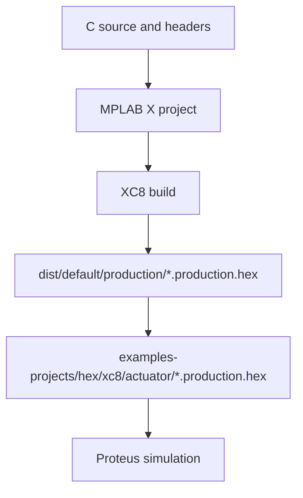

# Position Drive Library

[Ukrainian version](./position_drive.ua.md)

## Purpose

`position_drive` is a non-blocking closed-loop position control library for a DC gear motor with
a position sensor. It commands the motor direction until the measured position reaches the
requested target angle. The library never touches hardware directly: all hardware access goes
through callbacks supplied by the application, so the same control logic works with any wiring or
driver stack.

## When to Use

- Positioning an arm, valve, camera gimbal, or antenna driven by a DC gear motor.
- When the position sensor is a potentiometer read through an ADC (first version).
- When the application loop is non-blocking and must keep running while the motor moves.
- When you need hard limits, move timeouts, stuck detection, and fail-safe motor off on error.

## Supported Hardware

- MCU: any PIC18 supported by the platform (reference: PIC18F452).
- Motor: DC gear motor driven by an H-bridge (two direction pins, optional enable/PWM pin).
- Sensor: potentiometer on an ADC channel (`POSITION_DRIVE_SENSOR_ADC` backend).
- Time: millisecond tick source (platform `drivers/timers/tick`).

## Architecture

- The application owns the hardware and passes callbacks to the library.
- `position_drive_process()` is called from the main loop and never blocks.
- The ADC backend is implemented; the encoder backend is only a placeholder.
- Debug output is callback-based, so the library does not depend on UART or display code when debug is off.

## Sensor Backends

The sensor backend is selected at compile time through `POSITION_DRIVE_SENSOR_TYPE`:

| Backend          | Status |
|------------------|--------|
| `POSITION_DRIVE_SENSOR_ADC` | implemented |
| `POSITION_DRIVE_SENSOR_ENCODER` | placeholder, `init()` returns `DRV_STATUS_UNSUPPORTED` |
| `POSITION_DRIVE_SENSOR_NONE` | placeholder, `init()` returns `DRV_STATUS_UNSUPPORTED` |

The encoder backend is reserved for future use. It is not implemented: `init()` returns
`DRV_STATUS_UNSUPPORTED` instead of silently doing the wrong thing.

## Public API

- `position_drive_init()`
- `position_drive_process()`
- `position_drive_move_to_deg()`
- `position_drive_stop()`
- `position_drive_emergency_stop()`
- `position_drive_set_speed_percent()`
- `position_drive_get_current_deg()`
- `position_drive_get_target_deg()`
- `position_drive_get_current_raw()`
- `position_drive_get_state()`
- `position_drive_get_error()`
- `position_drive_clear_error()`

## Callbacks

- `position_drive_get_tick_fn_t` - millisecond time source (e.g. `tick_get`)
- `position_drive_read_raw_fn_t` - raw position sensor read
- `position_drive_motor_cb_t` - DC motor direction (STOP/FORWARD/REVERSE)
- `position_drive_set_speed_cb_t` - optional PWM speed, required only when PWM support is enabled
- `position_drive_debug_cb_t` - optional debug output, routed by the application to UART, display, or a test harness

Every callback receives the same `context` pointer that the application stored in the config.

## Configuration Structure

`position_drive_config_t`:

- sensor raw range (`sensor_raw_min`, `sensor_raw_max`) mapped to angle range
  (`angle_min_deg`, `angle_max_deg`)
- deadband around the target (`target_tolerance_deg`)
- move timeout (`move_timeout_ms`)
- stuck detection (`stuck_timeout_ms`, `stuck_min_delta_raw`)
- polarity flip (`direction_inverted`)
- speed range (`speed_min_percent`, `speed_max_percent`, `speed_default_percent`)

`init()` rejects an invalid config (missing callbacks, empty raw/angle range, zero tolerance,
zero timeout, speed range out of order) and stops the motor before returning.

## Debug Configuration

Current implementation uses a module-local compile-time switch:

| Option | Default | Notes |
| --- | --- | --- |
| `POSITION_DRIVE_ENABLE_UART_DEBUG` | `0` | enables `debug_cb` calls and debug formatting |
| `POSITION_DRIVE_DEBUG_LEVEL_ERROR` | `1` | error messages |
| `POSITION_DRIVE_DEBUG_LEVEL_INFO` | `2` | state change messages |
| `POSITION_DRIVE_DEBUG_LEVEL_TRACE` | `3` | state + raw/angle/target/direction details |
| `POSITION_DRIVE_DEBUG_LEVEL` | info when debug is enabled | override to reduce code size |

Debug sinks are application-level patterns:

- none: leave debug disabled
- UART: forward `debug_cb` to `libraries/system/uart_debug`
- display: forward `debug_cb` to an LCD or seven-segment adapter in the application
- callback: route to a test logger or other transport

## State Machine



`position_drive_process()` drives the transitions; no application action is required while moving.
State names match the enum in `position_drive.h`: `POSITION_DRIVE_STATE_IDLE`, `MOVING`,
`TARGET_REACHED`, `ERROR`. A failed `init()` or an invalid command reports an error code through
`position_drive_get_error()` while the drive stays uninitialized and the public state remains
`IDLE`; the `ERROR` state is entered by `process()` on a runtime fault (sensor / timeout / stuck /
direction mismatch).

## Control Model

`position_drive_move_to_deg()` schedules an asynchronous move. The application must call
`position_drive_process()` regularly from the main loop. The library:

1. reads the sensor and converts the raw value to degrees (integer math only)
2. applies bang-bang direction control with overshoot correction
3. detects timeouts and mechanical stuck conditions
4. verifies the sensor keeps moving in the commanded direction

On any error the motor is stopped immediately and the drive enters `POSITION_DRIVE_STATE_ERROR`.

## Runtime Flow

`position_drive_init()` validates the config, stops the motor, reads the sensor once and enters
`IDLE`. The application then calls `position_drive_move_to_deg()` and runs `position_drive_process()`
from the main loop until the target is reached.



## Movement Algorithm



The current implementation is bang-bang control with overshoot correction, not PID.

## Safety and Error Handling

Every detected fault follows the same path: motor outputs are stopped first, the state moves to
`ERROR`, the error code is latched, and the application is left to inspect and clear it.
`position_drive_clear_error()` only returns to `IDLE`; it never restarts the motor by itself.



## Raw-to-Angle Conversion

Integer-safe, no float:

```text
deg = angle_min_deg + ((raw - sensor_raw_min) * (angle_max_deg - angle_min_deg))
                        / (sensor_raw_max - sensor_raw_min)
```

`init()` rejects configs where `raw_span * angle_span` overflows `int32_t`, so the conversion
cannot wrap on PIC18.

## Sensor Calibration

1. Manually move the arm to the mechanical minimum and record the raw ADC value into
   `sensor_raw_min`.
2. Move to the mechanical maximum and record the value into `sensor_raw_max`.
3. Choose `angle_min_deg` / `angle_max_deg` to match the mechanical travel.
4. Set `target_tolerance_deg` to the smallest deadband that does not oscillate.
5. If the direction reacts opposite to the wiring, set `direction_inverted = 1`.

## Compile-Time Options

Defaults live in `core/pic_platform_config.h` and can be overridden with compiler `-D` flags:

| Option | Default |
|--------|---------|
| `POSITION_DRIVE_SENSOR_TYPE` | `POSITION_DRIVE_SENSOR_ADC` |
| `POSITION_DRIVE_ENABLE_PWM` | `0` |
| `POSITION_DRIVE_ENABLE_TIMEOUT` | `1` |
| `POSITION_DRIVE_ENABLE_STUCK_DETECTION` | `1` |
| `POSITION_DRIVE_ENABLE_DIRECTION_CHECK` | `1` |
| `POSITION_DRIVE_ENABLE_UART_DEBUG` | `0` |
| `POSITION_DRIVE_DEBUG_LEVEL` | info when debug is enabled |

Override them from the build flags, not from `project_config.h`, so the library translation unit
sees the same value.

The options resolve as follows:



## Example Project

`example.c` demonstrates a move sequence (30 deg -> 120 deg) with a potentiometer sensor and an
H-bridge motor. A complete MPLAB X project lives in
`examples-projects/xc8/actuator/position_drive_adc.X`.

## C18 Integration

The library source is compiler-independent and builds with MPLAB C18 through the include stub
`C18/libraries/actuator/position_drive/position_drive.c`. To use it in a C18 project add that stub
to `Source Files`, provide the same callbacks as the XC8 example (`read_raw`, `get_tick`,
`motor`), and forward the timer interrupt to `timer1_irq_handler()`.

A dedicated C18 example project (`examples-projects/c18/actuator/position_drive_adc/`) is planned
but not generated yet. Do not add a hand-made C18 example that has not been build-verified.

## Proteus Wiring

Wiring and simulation notes are documented in
`examples-projects/proteus/actuator/position_drive_adc/README.md`.



Key points:

- Potentiometer ends to +5V and GND, wiper to RA0/AN0.
- H-bridge IN1/IN2 from RD0/RD1; EN/PWM optional on RD2.
- Motor driver supply per motor voltage, common GND with the PIC.
- UART TX on RC6 -> Virtual Terminal RXD, 9600 8N1.
- MCLR pulled up through 10k; VDD/VSS per DIP-40.

## Dependency Graph



## Debug Routing



- implemented: callback routing and compile-time enable/level control
- supported pattern: UART, display, or test logger sinks through the application callback
- planned: a shared platform-wide debug abstraction
- not implemented yet: direct display sink inside `position_drive`

## Safety Notes

- On `position_drive_init()` the motor is forced to STOP before any validation.
- A failed init never leaves the motor running.
- A sensor read failure or out-of-range raw value stops the motor.
- `position_drive_emergency_stop()` stops motor and PWM immediately and preserves the error state
  for inspection.
- `position_drive_clear_error()` leaves the error state but never restarts the motor.
- Timeout and stuck detection stop the motor and latch an error.

## Resource Conflicts

- `Timer1` is owned by `tick`; a position drive project must not assign `Timer1` to another
  backend.
- `RA0/AN0` is analog while active; other analog-capable pins stay digital via `ADCON1`.
- `PORTD` PSP mode must be disabled before `RD0/RD1` are used as H-bridge outputs.
- Only one sensor backend per project; the ADC backend owns the ADC driver and channel.

## Known Limitations

- No PID; control is bang-bang with deadband and overshoot correction.
- No dynamic memory, no float math.
- One target at a time; no path planning.
- The encoder backend is a placeholder in this version.

## Future Encoder Support

The sensor abstraction (`read_raw` callback) and `POSITION_DRIVE_SENSOR_ENCODER` identifier are
in place. When an encoder driver exists in the platform, the encoder backend can be implemented
behind the same callback and state machine without changing the public API.

## Dependencies

- `core/*` (compiler, types, platform config)
- optional time source via `drivers/timers/tick`
- optional ADC sensor via `drivers/analog/adc`
- optional PWM speed via `drivers/timers/pwm`

## HEX Generation



See [generation workflow](../architecture/generation-workflow.md) for the exact commands and the
HEX copy mapping.
