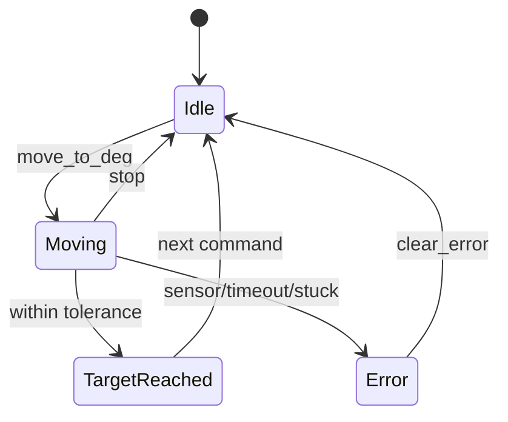
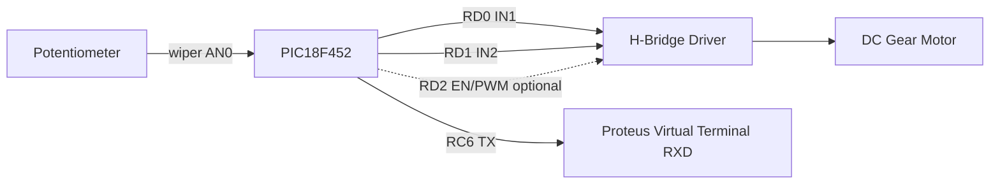
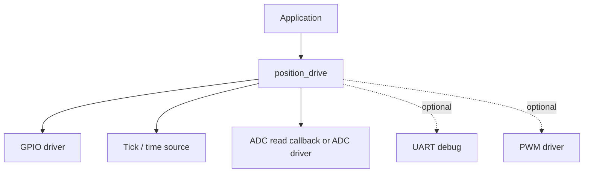
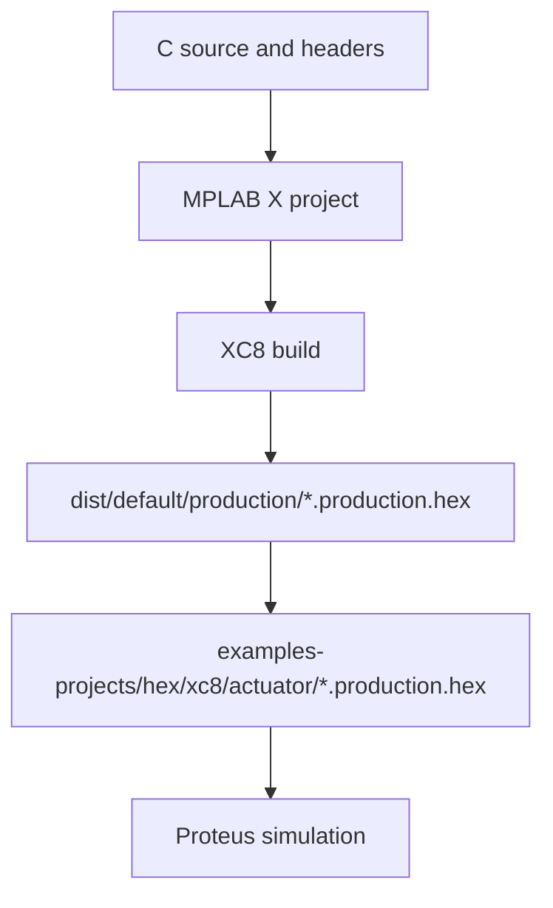

# Бібліотека Позиційного Приводу

[English version](./position_drive.md)

## Опис

`position_drive` — неблокуюча бібліотека замкненого керування положенням для двигуна з
редуктором і датчиком положення. Вона керує напрямком обертання двигуна, поки виміряна позиція
не досягне заданого цільового кута. Бібліотека ніколи не працює з апаратурою напряму: увесь
доступ до заліза відбувається через callback'и, які надає застосунок, тож одна логіка керування
працює з будь-яким розведенням чи драйверним стеком.

## Коли використовувати

- Позиціонування важеля, клапана, підвісу камери чи антени, які приводить DC-мотор із редуктором.
- Коли датчиком положення є потенціометр, який читається через ADC (перша версія).
- Коли головний цикл застосунку неблокуючий і має продовжувати роботу, поки мотор рухається.
- Коли потрібні жорсткі межі, timeout руху, виявлення застрягання та гарантоване вимкнення
  мотора за будь-якої помилки.

## Підтримуване залізо

- МК: будь-який PIC18 платформи (еталон: PIC18F452).
- Мотор: DC-мотор із редуктором, який керується H-мостом (два піни напрямку, опційний пін
  enable/PWM).
- Датчик: потенціометр на ADC-каналі (бекенд `POSITION_DRIVE_SENSOR_ADC`).
- Час: мілісекундне джерело часу (платформний `drivers/timers/tick`).

## Бекенди датчиків

Бекенд датчика обирається на етапі компіляції через `POSITION_DRIVE_SENSOR_TYPE`:

| Бекенд | Статус |
|--------|--------|
| `POSITION_DRIVE_SENSOR_ADC` | реалізовано |
| `POSITION_DRIVE_SENSOR_ENCODER` | заглушка, `init()` повертає `DRV_STATUS_UNSUPPORTED` |
| `POSITION_DRIVE_SENSOR_NONE` | заглушка, `init()` повертає `DRV_STATUS_UNSUPPORTED` |

Encoder-бекенд зарезервований на майбутнє. Він не реалізований: `init()` повертає
`DRV_STATUS_UNSUPPORTED`, а не мовчки робить не те.

## Публічний API

- `position_drive_init()`
- `position_drive_process()`
- `position_drive_move_to_deg()`
- `position_drive_stop()`
- `position_drive_emergency_stop()`
- `position_drive_set_speed_percent()`
- `position_drive_get_current_deg()`
- `position_drive_get_target_deg()`
- `position_drive_get_current_raw()`
- `position_drive_get_state()`
- `position_drive_get_error()`
- `position_drive_clear_error()`

## Callback'и

- `position_drive_get_tick_fn_t` — мілісекундне джерело часу (напр. `tick_get`)
- `position_drive_read_raw_fn_t` — зчитування сирого значення датчика
- `position_drive_motor_cb_t` — напрямок двигуна (STOP/FORWARD/REVERSE)
- `position_drive_set_speed_cb_t` — опційна PWM-швидкість, потрібна лише коли PWM увімкнено
- `position_drive_debug_cb_t` — опційний debug-вивід, використовується лише з UART debug

Кожен callback отримує однаковий вказівник `context`, який застосунок зберіг у конфігурації.

## Конфігурація

`position_drive_config_t`:

- діапазон raw датчика (`sensor_raw_min`, `sensor_raw_max`) зіставлений з діапазоном кутів
  (`angle_min_deg`, `angle_max_deg`)
- мертва зона навколо цілі (`target_tolerance_deg`)
- timeout руху (`move_timeout_ms`)
- виявлення застрягання (`stuck_timeout_ms`, `stuck_min_delta_raw`)
- інверсія полярності (`direction_inverted`)
- діапазон швидкості (`speed_min_percent`, `speed_max_percent`, `speed_default_percent`)

`init()` відхиляє невалідну конфігурацію (відсутні callback'и, порожній raw/angle діапазон,
нульовий допуск, нульовий timeout, порушений порядок швидкостей) і перед поверненням зупиняє мотор.

## Модель станів



Переходи виконує `position_drive_process()`; дій від застосунку під час руху не потрібно.

## Модель Керування

`position_drive_move_to_deg()` запускає асинхронний рух. Застосунок повинен регулярно
викликати `position_drive_process()` у головному циклі. Бібліотека:

1. зчитує датчик і переводить raw-значення в градуси (лише цілочисельна математика)
2. застосовує bang-bang керування напрямком із корекцією перельоту
3. виявляє timeout і механічне застрягання
4. перевіряє, що датчик рухається у заданому напрямку

За будь-якої помилки мотор негайно зупиняється, а привод переходить у
`POSITION_DRIVE_STATE_ERROR`.

## Перерахунок raw у градуси

Цілочисельний, безпечний, без float:

```text
deg = angle_min_deg + ((raw - sensor_raw_min) * (angle_max_deg - angle_min_deg))
                        / (sensor_raw_max - sensor_raw_min)
```

`init()` відхиляє конфігурації, де `raw_span * angle_span` переповнює `int32_t`, тож
перетворення не може переповнитись на PIC18.

## Калібрування датчика

1. Вручну переведіть важіль у механічний мінімум і запишіть raw-значення ADC у
   `sensor_raw_min`.
2. Переведіть у механічний максимум і запишіть значення у `sensor_raw_max`.
3. Оберіть `angle_min_deg` / `angle_max_deg` відповідно до механічного ходу.
4. Встановіть `target_tolerance_deg` як найменшу мертву зону без коливань.
5. Якщо напрямок реакції протилежний розведенню, встановіть `direction_inverted = 1`.

## Опції Компіляції

Дефолти в `core/pic_platform_config.h`, перевизначаються через `-D` прапорці компілятора:

| Опція | Дефолт |
|-------|--------|
| `POSITION_DRIVE_SENSOR_TYPE` | `POSITION_DRIVE_SENSOR_ADC` |
| `POSITION_DRIVE_ENABLE_PWM` | `0` |
| `POSITION_DRIVE_ENABLE_TIMEOUT` | `1` |
| `POSITION_DRIVE_ENABLE_STUCK_DETECTION` | `1` |
| `POSITION_DRIVE_ENABLE_DIRECTION_CHECK` | `1` |
| `POSITION_DRIVE_ENABLE_UART_DEBUG` | `0` |

Перевизначайте їх через прапорці збірки, а не через `project_config.h`, щоб трансляційний
модуль бібліотеки бачив те саме значення.

## Приклад

`example.c` демонструє послідовність рухів (30° -> 120°) з потенціометром як датчиком і
H-мостом. Повний проєкт MPLAB X знаходиться у `examples-projects/xc8/actuator/position_drive_adc.X`.

## Інтеграція з C18

Вихідний код бібліотеки не залежить від компілятора і збирається з MPLAB C18 через include-стаб
`C18/libraries/actuator/position_drive/position_drive.c`. Щоб використати його у C18-проєкті,
додайте цей стаб у `Source Files`, надайте ті самі callback'и, що й у XC8-прикладі
(`read_raw`, `get_tick`, `motor`), і передавайте переривання таймера у `timer1_irq_handler()`.

Окремий C18-приклад (`examples-projects/c18/actuator/position_drive_adc/`) запланований,
але ще не згенерований. Не додавайте власноруч зроблений C18-приклад, який не був
перевірений збіркою.

## Підключення у Proteus

Схема та примітки для симуляції описані у
`examples-projects/proteus/actuator/position_drive_adc/README.md`.



Ключові моменти:

- Кінці потенціометра до +5V і GND, повзунок до RA0/AN0.
- IN1/IN2 H-моста з RD0/RD1; EN/PWM опційно на RD2.
- Живлення драйвера мотора за напругою мотора, спільний GND із PIC.
- UART TX на RC6 -> Virtual Terminal RXD, 9600 8N1.
- MCLR підтягнутий через 10k; VDD/VSS за DIP-40.

## Граф залежностей



## Безпека

- У `position_drive_init()` мотор примусово переводиться у STOP до будь-якої валідації.
- Невдала ініціалізація ніколи не лишає мотор увімкненим.
- Помилка зчитування датчика або raw поза діапазоном зупиняє мотор.
- `position_drive_emergency_stop()` негайно зупиняє мотор і PWM, зберігаючи стан помилки
  для аналізу.
- `position_drive_clear_error()` виходить зі стану помилки, але ніколи не запускає мотор.
- Timeout і виявлення застрягання зупиняють мотор і фіксують помилку.

## Конфлікти ресурсів

- `Timer1` належить `tick`; у проєкті приводу не можна призначати `Timer1` іншому бекенду.
- `RA0/AN0` аналоговий, поки активний; інші аналогові піни лишаються цифровими через `ADCON1`.
- PSP-режим `PORTD` потрібно вимкнути, перш ніж `RD0/RD1` стануть виходами H-моста.
- Лише один бекенд датчика на проєкт; ADC-бекенд володіє ADC-драйвером і каналом.

## Відомі обмеження

- Немає PID; керування bang-bang із мертвою зоною і корекцією перельоту.
- Без dynamic memory, без float-математики.
- Одна ціль за раз; без планування траєкторії.
- Encoder-бекенд у цій версії — заглушка.

## Майбутня підтримка encoder

Абстракція датчика (callback `read_raw`) та ідентифікатор `POSITION_DRIVE_SENSOR_ENCODER` уже є.
Коли в платформі з'явиться готовий encoder-драйвер, encoder-бекенд можна реалізувати за тим
самим callback'ом і моделлю станів без зміни публічного API.

## Залежності

- `core/*` (compiler, types, platform config)
- опційне джерело часу через `drivers/timers/tick`
- опційний ADC-датчик через `drivers/analog/adc`
- опційна PWM-швидкість через `drivers/timers/pwm`

## Flow збірки



Точні команди та відображення копіювання HEX дивіться у
[workflow генерації](../architecture/generation-workflow.ua.md).
