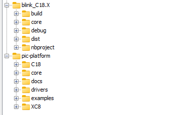
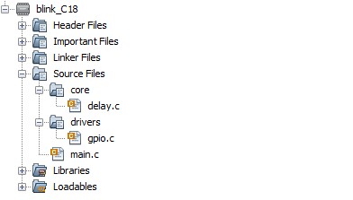
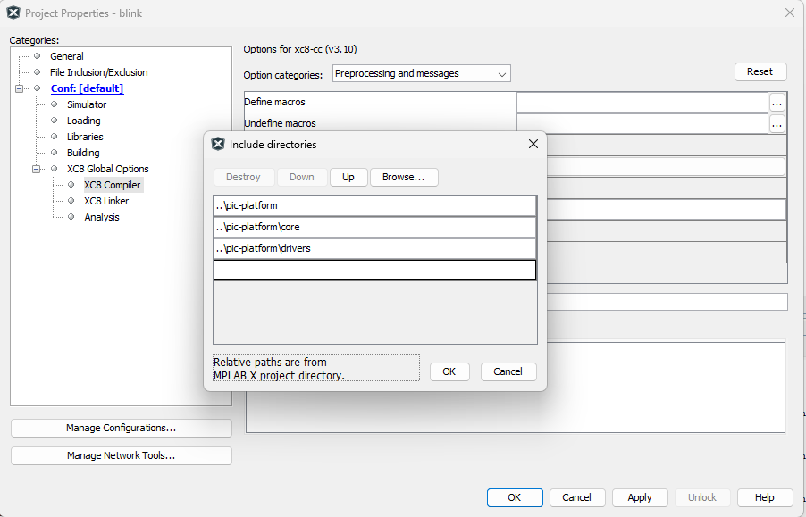

# MPLAB Integration

[🇺🇦 Ukrainian version](./mplab-integration.ua.md) | [Main README](../README.md)

This guide explains how to connect `pic-platform` as an external driver library in a PIC18 MPLAB X project.

The goal is simple:

- keep the application project clean;
- keep `pic-platform` reusable;
- avoid copying driver files into every project;
- use relative paths so the project remains portable.

---

## 1. Recommended Folder Structure

Keep the MPLAB project and the platform library side by side.

```text
pic18f452/
├── blink.X/          ← MPLAB application project
└── pic-platform/     ← external driver library
```

Example:



### Rules

- `blink.X` is the application project.
- `pic-platform` is the reusable driver library.
- Do not copy `core/` or `drivers/` into `blink.X`.
- Use relative paths only.

---

## 2. What MPLAB Needs

MPLAB needs two things:

1. **Include paths** for `.h` files.
2. **Source files** for `.c` files.

These are different things.

```text
.h files → found through include paths
.c files → must be added to Source Files
```

---

## 3. Add Source Files Correctly

MPLAB does not automatically compile `.c` files from external folders.

You must add every required `.c` file manually.

### Steps

1. Right-click **Source Files**.
2. Select **Add Existing Item**.
3. Choose required `.c` files from `../pic-platform/...`.
4. Keep the path as **Relative**.

Example:



### Example Source Files

For a simple GPIO blink test, add:

```text
../pic-platform/core/delay.c
../pic-platform/drivers/gpio/gpio.c
```

For UART, also add:

```text
../pic-platform/drivers/communication/uart/uart.c
```

For ADC, add:

```text
../pic-platform/drivers/analog/adc/adc.c
```

### Important

- Add only `.c` files to **Source Files**.
- Do not add `.h` files manually.
- Header files are resolved by include paths and `#include`.

---

## 4. Configure Include Paths

Open project properties:

```text
Project → Properties → XC8 Compiler or C18 Compiler → Include directories
```

Add these paths:

```text
../pic-platform
../pic-platform/core
../pic-platform/drivers
```

Example:



After this, includes like these will work:

```c
#include "core/compiler.h"
#include "core/delay.h"
#include "drivers/gpio/gpio.h"
```

---

## 5. Compiler Selection

The compiler is selected in MPLAB project settings.

Supported compilers:

- MPLAB XC8
- MPLAB C18

Compiler selection is not done by source code.

```text
MPLAB project settings → select XC8 or C18
```

The library adapts through `core/compiler.h`.

---

## 6. Compiler Abstraction

`core/compiler.h` detects the active compiler and defines internal platform macros:

```text
XC8 → DRV_COMPILER_XC8
C18 → DRV_COMPILER_C18
```

### Important Rules

- Do not force compiler mode in application code.
- Do not define both compiler macros manually.
- Do not include device headers inside the library.
- Device headers belong to the application layer.

---

## 7. Device Header Rule

Only the application project should include the MCU header.

### XC8 example

```c
#include <xc.h>
```

### C18 example

```c
#include <p18f452.h>
```

Do not include `p18fXXX.h` or `xc.h` inside:

```text
core/
drivers/
```

---

## 8. Minimal GPIO Example

This example tests:

- include paths;
- external source files;
- `core/delay`;
- `drivers/gpio`.

```c
#include <p18f452.h>

#include "core/compiler.h"
#include "core/delay.h"
#include "drivers/gpio/gpio.h"

#pragma config OSC = HS
#pragma config WDT = OFF
#pragma config LVP = OFF

void main(void)
{
    gpio_set_output(&TRISB, 0);

    while (1)
    {
        gpio_toggle(&PORTB, 0);
        delay_ms(500);
    }
}
```

Required source files:

```text
../pic-platform/core/delay.c
../pic-platform/drivers/gpio/gpio.c
```

---

## 9. Minimal UART Example

```c
#include <p18f452.h>

#include "core/compiler.h"
#include "drivers/communication/uart/uart.h"

#pragma config OSC = HS
#pragma config WDT = OFF
#pragma config LVP = OFF

void main(void)
{
    uart_init(9600u);
    uart_write_string("MPLAB integration OK\r\n");

    while (1)
    {
    }
}
```

Required source files:

```text
../pic-platform/drivers/communication/uart/uart.c
```

If UART depends on other modules in your implementation, add those `.c` files too.

---

## 10. Build Checklist

Before building, check:

- required `.c` files are added to **Source Files**;
- no `.h` files were added manually;
- include paths use relative paths;
- selected compiler is XC8 or C18;
- only one MCU header is included by the application;
- `core/` and `drivers/` do not include device headers;
- build succeeds without unresolved symbols.

---

## 11. Common Errors

### `file not found`

Reason:

```text
Include path is missing or incorrect.
```

Fix:

```text
Add ../pic-platform, ../pic-platform/core, ../pic-platform/drivers
```

---

### `undefined symbol` or `could not find definition`

Reason:

```text
The `.h` file is visible, but the `.c` implementation was not added to Source Files.
```

Fix:

```text
Add the required `.c` file to Source Files.
```

Example:

```text
undefined symbol delay_ms
```

Fix:

```text
Add ../pic-platform/core/delay.c
```

---

### `_CONFIG_DECL does not agree`

Reason:

```text
More than one device header is included, or device headers are included inside the library.
```

Fix:

```text
Only main.c should include <p18f452.h> or <xc.h>.
Remove device includes from core/ and drivers/.
```

---

## 12. Final Rule

```text
Application project = main logic
pic-platform = reusable drivers
```

Keep them separated.

Do not turn the library into an application project.
