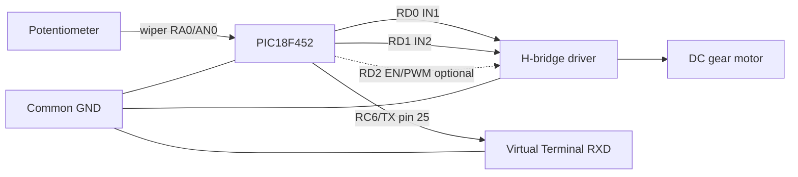
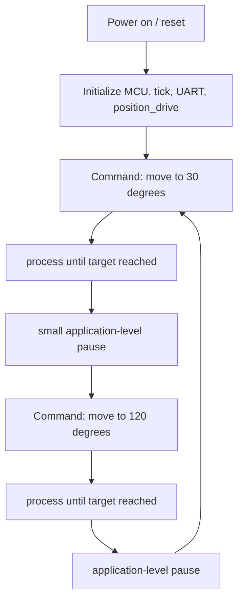

# position_drive_adc Proteus Simulation

[Ukrainian version](./README.ua.md)

## Status

Not yet built in Proteus. The `.pdsprj` project file is pending manual creation in Proteus.

## Firmware

XC8 HEX:

`../../../hex/xc8/actuator/position_drive_adc.X.production.hex`

C18 HEX is not available yet for this project (C18 example is planned).

## MPLAB Projects

- `../../../xc8/actuator/position_drive_adc.X`
- C18 example: not generated yet, wrapper exists at `C18/libraries/actuator/position_drive/`

## PIC18F452 Connections

| Signal | PIC18F452 pin | Proteus connection | Notes |
|---|---|---|---|
| Potentiometer wiper | RA0 / AN0 / pin 2 | Potentiometer wiper | position sensor |
| Potentiometer end A | - | +5V | |
| Potentiometer end B | - | GND | |
| H-bridge IN1 | RD0 / pin 19 | Motor driver IN1 | |
| H-bridge IN2 | RD1 / pin 20 | Motor driver IN2 | |
| H-bridge EN/PWM | RD2 / pin 21 | Motor driver EN | optional, PWM disabled by default |
| UART TX | RC6 / pin 25 | Virtual Terminal RXD | 9600 8N1 |
| VDD | pins 11, 32 | +5V | |
| VSS | pins 12, 31 | GND | common GND with motor driver |
| MCLR | pin 1 | Pulled up through 10k to +5V | |

Oscillator: configured in `config_bits.c` of the example project (XT, 10 MHz).

## Wiring Diagram



ASCII:

```text
Potentiometer:  +5V -o- [POT] -o- GND
                            |
                            +--> RA0/AN0 (pin 2)  PIC18F452
PIC RD0 (pin 19)  ---> IN1   H-Bridge Driver
PIC RD1 (pin 20)  ---> IN2   H-Bridge Driver
PIC RD2 (pin 21)  -.-> EN    H-Bridge Driver (optional PWM)
H-Bridge OUT1/OUT2 --> DC gear motor
PIC RC6 (pin 25)  ---> Virtual Terminal RXD  (9600 8N1)
PIC VDD (11, 32)  ---> +5V,  PIC VSS (12, 31) ---> GND (common)
PIC MCLR (pin 1)  ---> 10k pull-up to +5V
```

## Expected Result



On boot the drive is initialized and the current potentiometer position is read. The arm moves
to 30 degrees, then to 120 degrees, and repeats. The Virtual Terminal prints the state and
`PD:*` library messages at 9600 baud, 8N1. Moving the potentiometer wiper changes the measured
position and the reported angle.

## Notes

- Do not copy HEX into this folder.
- Rebuild the MPLAB project to refresh HEX.
- Proteus should load HEX from the shared `hex/` folder.
- Motor driver supply must match the motor voltage; the ground must be common with the PIC.
- Update `proteus-version.txt` and commit the real `.pdsprj` after manually creating the Proteus project.
