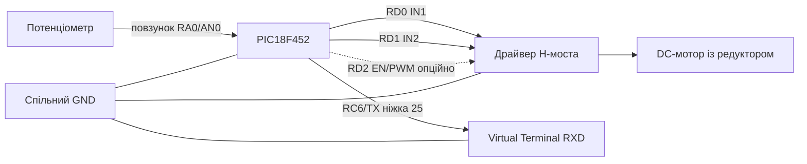
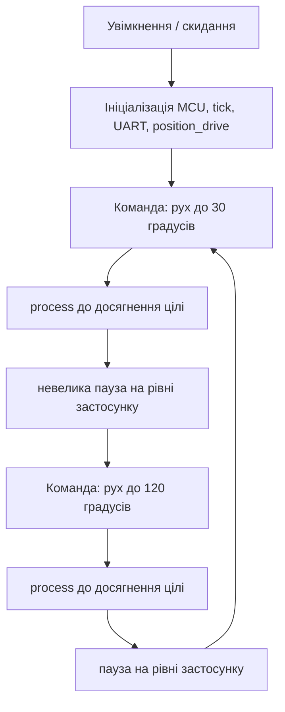

# position_drive_adc — симуляція у Proteus

[English version](./README.md)

## Статус

Ще не зібрано в Proteus. Файл проєкту `.pdsprj` очікує ручного створення в Proteus.

## Firmware

XC8 HEX:

`../../../hex/xc8/actuator/position_drive_adc.X.production.hex`

C18 HEX поки недоступний для цього проєкту (C18-приклад запланований).

## MPLAB-проєкти

- `../../../xc8/actuator/position_drive_adc.X`
- C18-приклад: ще не згенерований, wrapper наявний у `C18/libraries/actuator/position_drive/`

## Підключення до PIC18F452

| Сигнал | Ніжка PIC18F452 | Підключення у Proteus | Примітки |
|---|---|---|---|
| Повзунок потенціометра | RA0 / AN0 / pin 2 | Повзунок потенціометра | датчик положення |
| Кінець A потенціометра | - | +5V | |
| Кінець B потенціометра | - | GND | |
| IN1 H-моста | RD0 / pin 19 | IN1 драйвера мотора | |
| IN2 H-моста | RD1 / pin 20 | IN2 драйвера мотора | |
| EN/PWM H-моста | RD2 / pin 21 | EN драйвера мотора | опційно, PWM вимкнено за замовчуванням |
| UART TX | RC6 / pin 25 | Virtual Terminal RXD | 9600 8N1 |
| VDD | pins 11, 32 | +5V | |
| VSS | pins 12, 31 | GND | спільний GND із драйвером мотора |
| MCLR | pin 1 | Pull-up 10k до +5V | |

Генератор: налаштований у `config_bits.c` прикладу (XT, 10 MHz).

## Схема підключення



ASCII:

```text
Potentiometer:  +5V -o- [POT] -o- GND
                            |
                            +--> RA0/AN0 (pin 2)  PIC18F452
PIC RD0 (pin 19)  ---> IN1   H-Bridge Driver
PIC RD1 (pin 20)  ---> IN2   H-Bridge Driver
PIC RD2 (pin 21)  -.-> EN    H-Bridge Driver (опційний PWM)
H-Bridge OUT1/OUT2 --> DC gear motor
PIC RC6 (pin 25)  ---> Virtual Terminal RXD  (9600 8N1)
PIC VDD (11, 32)  ---> +5V,  PIC VSS (12, 31) ---> GND (спільний)
PIC MCLR (pin 1)  ---> pull-up 10k до +5V
```

## Очікуваний результат



Після завантаження привод ініціалізується і зчитується поточне положення потенціометра. Важіль
рухається до 30°, потім до 120° і повторює цикл. Virtual Terminal виводить стан і повідомлення
бібліотеки `PD:*` на 9600 бод, 8N1. Обертання повзунка потенціометра змінює виміряне положення
і виведений кут.

## Примітки

- Не копіюйте HEX у цю папку.
- Після збірки оновлюйте HEX через MPLAB-проєкт.
- Proteus має завантажувати HEX зі спільної папки `hex/`.
- Живлення драйвера мотора має відповідати напрузі мотора; земля має бути спільною з PIC.
- Після ручного створення проєкту в Proteus оновіть `proteus-version.txt` і закомітьте реальний `.pdsprj`.
