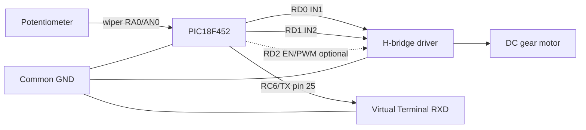
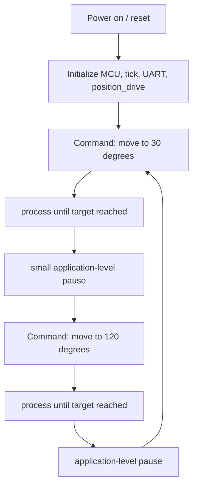

[English version](./README.md)

# position_drive_adc.X

## Призначення

Приклад замкненого позиційного приводу. Двигун із редуктором переміщує важіль на заданий кут,
потенціометр виконує роль датчика положення (ADC-бекенд бібліотеки `position_drive`).

## Потрібні вихідні файли

- `main.c`
- `config_bits.c`
- `project_config.h`
- `../../../../core/delay.c`
- `../../../../drivers/analog/adc/adc.c`
- `../../../../drivers/gpio/gpio.c`
- `../../../../drivers/timers/tick/tick.c`
- `../../../../drivers/timers/timer1/timer1.c`
- `../../../../libraries/actuator/position_drive/position_drive.c`
- `../../../../libraries/system/uart_debug/uart_debug.c`

## Що демонструє

- ініціалізацію `position_drive`, `move_to_deg` та неблокуючий `process`
- датчик положення через ADC і callback `read_raw` (`adc_read`)
- керування H-мостом через callback `motor`
- мілісекундний час від `tick` як джерело часу приводу
- UART-дebug вивід стану
- автоматичну послідовність рухів 30° -> 120° -> цикл

## Контакти

| Ніжка PIC | Сигнал | Підключення до | Примітки |
| --- | --- | --- | --- |
| RA0/AN0 | position feedback | повзунок потенціометра | кінці до +5V/GND |
| RD0 | IN1 | вхід 1 H-моста | напрямок мотора |
| RD1 | IN2 | вхід 2 H-моста | напрямок мотора |
| RD2 | EN/PWM | опційний enable/PWM | за замовчуванням не використовується |
| RC6/TX | UART TX | Virtual Terminal RXD | 9600 8N1 |
| VDD/VSS | живлення | +5V/GND | обов'язково |
| MCLR | reset | pull-up 10k | обов'язково |

## Розведення в Proteus



Повна схема є у `../../../proteus/actuator/position_drive_adc/README.ua.md`.

## UART debug wiring

- `RC6/TX` -> `RXD` Virtual Terminal
- `GND` -> `GND` Virtual Terminal
- Формат UART: `9600 8N1`

## Конфігурація приводу

- діапазон raw 0..1023 відповідає 0..270 градусам
- допуск 2 градуси
- timeout руху 5000 мс
- виявлення застрягання 1000 мс з мінімальним рухом у 4 raw-лічильника
- `POSITION_DRIVE_ENABLE_UART_DEBUG=1` вмикає повідомлення `PD:*` через debug callback

## Як зібрати

```cmd
make -f nbproject\Makefile-default.mk SUBPROJECTS= .build-conf
```

Команду запускайте з `examples-projects\xc8\actuator\position_drive_adc.X`.

## HEX

- Генерується MPLAB X у `dist/default/production/position_drive_adc.X.production.hex`
- Артефакт репозиторію: `examples-projects/hex/xc8/actuator/position_drive_adc.X.production.hex`

## Динаміка



- після завантаження привод ініціалізується і зчитується поточне положення потенціометра
- важіль рухається до 30°, чекає досягнення цілі, потім рухається до 120°
- на кожній ітерації циклу викликається `position_drive_process()`, щоб керування лишалося неблокуючим
- помилки (timeout, застрягання, датчик поза діапазоном) зупиняють мотор і виводяться через UART

## Очікувана поведінка

Після старту бібліотека ініціалізується, читає поточне положення потенціометра і далі чергує
рухи на 30° та 120°. Virtual Terminal показує стан застосунку та повідомлення `PD:*` від бібліотеки.

## Примітки

- Відображення H-моста зафіксовано розведенням: FORWARD = IN1 high, REVERSE = IN2 high.
  Якщо розведення інверсоване, у конфігурації потрібно змінити `direction_inverted`.
- `RD2` опційний і за замовчуванням не використовується, бо PWM тут вимкнено.

## Відомі обмеження

- Лише ADC-бекенд; encoder-бекенд ще не реалізований.
- Лише bang-bang керування; без PID.
- Одна ціль за раз.
- PWM speed output за замовчуванням вимкнений.

## Статус

Готово до перевірки у Proteus.
